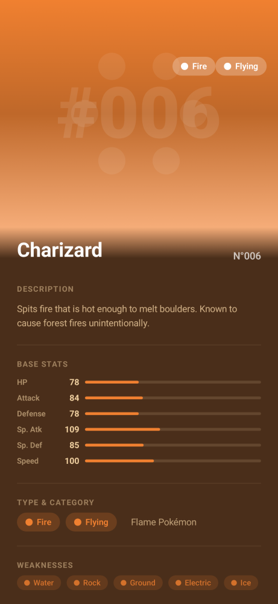
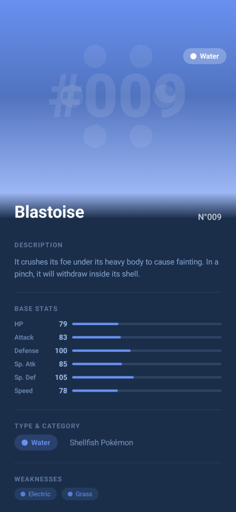
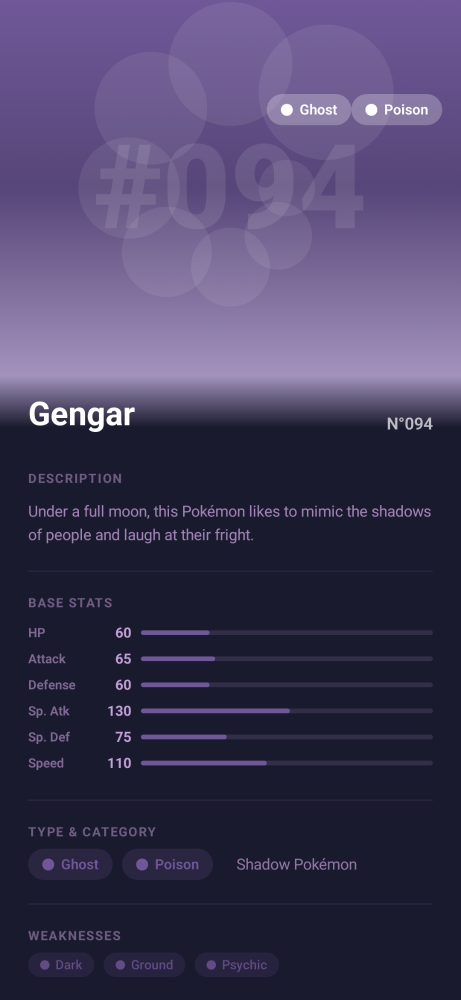

# BeautyPoke

Android application built with **MVVM + Clean Architecture + SOLID** principles.

## Tech Stack

| Layer | Technology |
|-------|------------|
| UI | Jetpack Compose + Material 3 |
| Architecture | MVVM, Clean Architecture, SOLID, Use Cases |
| Network | Retrofit + OkHttp |
| DI | Koin |
| Async | Kotlin Coroutines + Flow |
| Navigation | Jetpack Navigation Compose |
| Image Loading | Coil |
| Serialization | kotlinx-serialization-json |
| DateTime | kotlinx-datetime |
| Code Quality | ktlint + detekt |
| Screenshot Testing | Paparazzi |

## Architecture Overview

```
┌──────────────────────────────────────────────────────────────────┐
│                        PRESENTATION LAYER                        │
│                                                                  │
│  ┌──────────────┐    ┌──────────────────┐    ┌────────────────┐ │
│  │  Compose UI   │───>│   ViewModel      │───>│   UiState      │ │
│  │  (Screen/     │    │  (StateFlow)     │    │  (Sealed       │ │
│  │   Component)  │<───│                  │<───│   Interface)   │ │
│  └──────────────┘    └────────┬─────────┘    └────────────────┘ │
│                               │                                  │
├───────────────────────────────┼──────────────────────────────────┤
│                        DOMAIN LAYER                              │
│                               │                                  │
│                     ┌─────────▼─────────┐                       │
│                     │    Use Case       │                        │
│                     │  (single invoke)  │                        │
│                     └─────────┬─────────┘                       │
│                               │                                  │
│                     ┌─────────▼─────────┐                       │
│                     │   Repository      │                        │
│                     │   Interface       │                        │
│                     └─────────┬─────────┘                       │
│                               │                                  │
├───────────────────────────────┼──────────────────────────────────┤
│                        DATA LAYER                                │
│                               │                                  │
│              ┌────────────────┼────────────────┐                 │
│              │                │                │                 │
│    ┌─────────▼─────────┐  ┌──▼──────────┐  ┌──▼──────────┐     │
│    │  Remote (Retrofit) │  │   Local     │  │  Mapper     │     │
│    │  API Service      │  │   (Room)    │  │  DTO↔Entity │     │
│    │  DTOs             │  │   DAO       │  │  ↔Domain    │     │
│    └───────────────────┘  │   Entity    │  └─────────────┘     │
│                           └─────────────┘                      │
└──────────────────────────────────────────────────────────────────┘
```

### Data flow

```
User scrolls pager
       │
       ▼
onPageSelected(index) ──> ViewModel
                              │
                              ▼
                    GetPokemonRangeUseCase
                              │
                              ▼
                    PokemonRepositoryImpl
                          │        │
                          ▼        ▼
                    Room (cache)  API (Retrofit)
                          │        │
                          └──┬─────┘
                             ▼
                    Return Result<Pokemon>
                             │
                             ▼
                    ViewModel updates StateFlow
                             │
                             ▼
                    Compose UI re-renders
```

### Dependency direction

```
Presentation ──> Domain <── Data
                      │
                  No Android
                  dependencies
```

### Key decisions

- **Domain layer has zero framework dependencies** — pure Kotlin, no Android imports.
- **Repository interfaces live in domain**, implementations in `data`.
- **Use Cases are single-responsibility** classes with an `invoke` operator.
- **UI state is unidirectional**: Screen → Event → ViewModel → `StateFlow<UiState>` → Screen.
- **Retrofit** for REST; DTOs mapped to domain models with explicit mappers.

## Project Structure

```
com.mx.beautypoke
├── data
│   ├── remote          # Retrofit services, DTOs
│   │   ├── api/
│   │   ├── dto/
│   │   └── mapper/
│   ├── local           # Room database, DAOs, entities
│   │   ├── dao/
│   │   ├── database/
│   │   ├── entity/
│   │   └── mapper/
│   └── repository/     # Repository implementations
├── domain
│   ├── model/          # Domain entities
│   ├── repository/     # Repository interfaces
│   └── usecase/        # Business logic
├── di                  # Koin modules
│   ├── NetworkModule.kt
│   ├── DatabaseModule.kt
│   ├── RepositoryModule.kt
│   ├── UseCaseModule.kt
│   └── ViewModelModule.kt
└── presentation
    ├── navigation/     # NavHost & routes
    ├── theme/          # Compose theme + PokemonTheme palettes
    ├── component/      # Reusable composables
    ├── screen/         # Screen-level composables
    └── viewmodel/      # ViewModels
```

## Getting Started

1. Open the project in **Android Studio Ladybug (2024.3.1)** or newer.
2. Sync Gradle.
3. Run on emulator or device:

```bash
./gradlew installDebug
```

## Dependencies

| Category | Library | Version | Scope |
|----------|---------|---------|-------|
| **UI** | Jetpack Compose BOM | 2026.02.01 | implementation |
| | Compose Material 3 | (via BOM) | implementation |
| | Coil Compose | 2.7.0 | implementation |
| | Navigation Compose | 2.8.9 | implementation |
| **Architecture** | Lifecycle ViewModel Compose | 2.10.0 | implementation |
| | Lifecycle Runtime KTX | 2.10.0 | implementation |
| **Network** | Retrofit | 2.11.0 | implementation |
| | Retrofit Gson Converter | 2.11.0 | implementation |
| | OkHttp | 4.12.0 | implementation |
| | Gson | 2.11.0 | implementation |
| **Database** | Room Runtime | 2.7.1 | implementation |
| | Room KTX | 2.7.1 | implementation |
| | Room Compiler | 2.7.1 | annotationProcessor |
| **DI** | Koin Core | 4.0.2 | implementation |
| | Koin Android | 4.0.2 | implementation |
| | Koin AndroidX Compose | 4.0.2 | implementation |
| **Serialization** | kotlinx-serialization-json | 1.8.1 | implementation |
| **DateTime** | kotlinx-datetime | 0.6.2 | implementation |
| **Code Quality** | ktlint Gradle Plugin | 12.2.0 | plugin |
| | detekt Gradle Plugin | 1.23.8 | plugin |
| **Screenshot Testing** | Paparazzi | 2.0.0-alpha05 | plugin |
| **Testing** | JUnit 4 | 4.13.2 | test |
| | MockK | 1.13.14 | test, androidTest |
| | Turbine | 1.2.0 | test |
| | kotlinx-coroutines-test | 1.10.1 | test, androidTest |
| | Compose UI Test | (via BOM) | androidTest |

## Screenshots

Screenshots are generated automatically using [Paparazzi](https://github.com/cashapp/paparazzi) — no emulator needed.

| Charizard (Fire/Flying) | Blastoise (Water) | Gengar (Ghost/Poison) |
|:---:|:---:|:---:|
|  |  |  |

To regenerate:

```bash
./gradlew :app:recordPaparazziDebug
cp app/src/test/snapshots/images/*.png screenshots/
```

## Design System

A catalog of every UI component, its `@Preview`, Paparazzi snapshot reference, public API, and visual variants.

### PokemonTypeBadge

| Attribute | Value |
|-----------|-------|
| **File** | `presentation/component/PokemonTypeBadge.kt` |
| **Purpose** | Displays a Pokémon type as a colored badge. Used in the detail screen header and type/category section. |
| **Styles** | `PokemonTypeBadgeStyle.ROUNDED` — text-only pill. `PokemonTypeBadgeStyle.CIRCULAR` — dot + text pill. |
| **Default params** | `containerColor` — auto-resolved from `PokemonType` at 20% alpha. `contentColor` — full hex color from `PokemonType`. |
| **Preview** | `PokemonTypeBadgeRoundedPreview` (Fire, rounded), `PokemonTypeBadgeCircularPreview` (Water, circular) |
| **Paparazzi test** | — (used inline in `PokemonDetailCardSnapshots`) |

```kotlin
@Composable
fun PokemonTypeBadge(
    type: PokemonType,
    modifier: Modifier = Modifier,
    style: PokemonTypeBadgeStyle = PokemonTypeBadgeStyle.ROUNDED,
    containerColor: Color = Color(type.resolveColor().hex).copy(alpha = 0.2f),
    contentColor: Color = Color(type.resolveColor().hex)
)
```

### StatBar

| Attribute | Value |
|-----------|-------|
| **File** | `presentation/component/StatBar.kt` |
| **Purpose** | Animated horizontal progress bar for a base stat (HP, Attack, Defense, etc.). |
| **Animation** | 800ms `tween` on `animateFloatAsState` — animates from 0 → target width. Can be disabled via `animated = false`. |
| **Dark-panel compatible** | `onSurfaceColor` parameter for light text on dark surfaces. |
| **Preview** | `StatBarPreview` (HP 78, Fire-theme bar) |
| **Paparazzi test** | — (used inline in `PokemonDetailCardSnapshots`) |

```kotlin
@Composable
fun StatBar(
    stat: PokemonStat,
    barColor: Color,
    modifier: Modifier = Modifier,
    onSurfaceColor: Color = Color(0xFFE8DCF0),
    animated: Boolean = true
)
```

### WeaknessPill

| Attribute | Value |
|-----------|-------|
| **File** | `presentation/component/WeaknessPill.kt` |
| **Purpose** | Small pill badge showing a type weakness. Used in a `FlowRow` inside the detail card. |
| **Visual** | Colored dot + type name in a rounded pill, auto-resolved from `PokemonType.resolveColor()`. |
| **Preview** | `WeaknessPillPreview` (Grass type) |
| **Paparazzi test** | — (used inline in `PokemonDetailCardSnapshots`) |

```kotlin
@Composable
fun WeaknessPill(
    type: PokemonType,
    modifier: Modifier = Modifier,
    containerColor: Color = Color(type.resolveColor().hex).copy(alpha = 0.2f),
    contentColor: Color = Color(type.resolveColor().hex)
)
```

### MetricItem

| Attribute | Value |
|-----------|-------|
| **File** | `presentation/component/MetricItem.kt` |
| **Purpose** | Row with icon, bold value, and small label. Used for Weight and Height. |
| **Icons** | `Icons.Filled.MonitorWeight` and `Icons.Filled.Straighten` in the screen, but any `ImageVector` is accepted. |
| **Preview** | `MetricItemWeightPreview` (9.0 kg), `MetricItemHeightPreview` (0.7 m) |
| **Paparazzi test** | — (used inline in `PokemonDetailCardSnapshots`) |

```kotlin
@Composable
fun MetricItem(
    icon: ImageVector,
    label: String,
    value: String,
    modifier: Modifier = Modifier,
    onSurfaceColor: Color = Color(0xFFE8DCF0)
)
```

### InfoSection

| Attribute | Value |
|-----------|-------|
| **File** | `presentation/component/InfoSection.kt` |
| **Purpose** | Wrapper with an uppercase section title + arbitrary content. Used for Description, Base Stats, Type & Category, Weaknesses, Weight & Height. |
| **Content lambda** | `content: @Composable (Modifier) -> Unit` — receives a `Modifier` for padding, though currently unused. |
| **Preview** | `InfoSectionPreview` (DESCRIPTION section with sample text) |
| **Paparazzi test** | — (used inline in `PokemonDetailCardSnapshots`) |

```kotlin
@Composable
fun InfoSection(
    title: String,
    modifier: Modifier = Modifier,
    onSurfaceColor: Color = Color(0xFFE8DCF0),
    content: @Composable (Modifier) -> Unit
)
```

### AbstractPattern

| Attribute | Value |
|-----------|-------|
| **File** | `presentation/component/AbstractPattern.kt` |
| **Purpose** | Decorative Canvas pattern based on primary `PokemonType`. Rendered behind the Pokémon image in the header. |
| **Pattern legend** | `PSYCHIC` → geometric circles in a ring. `GHOST` → overlapping smoke circles. `DRAGON` → concentric ring strokes. All others → dots in a hex arrangement. |
| **Previews** | `AbstractPatternFirePreview` (dots), `AbstractPatternPsychicPreview` (geometric), `AbstractPatternGhostPreview` (smoke), `AbstractPatternDragonPreview` (rings) |
| **Paparazzi test** | — (used inline in `PokemonDetailCardSnapshots`) |

```kotlin
@Composable
fun AbstractPattern(
    type: PokemonType,
    modifier: Modifier = Modifier,
    patternColor: Color = Color.White.copy(alpha = 0.08f)
)
```

### PokemonDetailCard (Screen)

| Attribute | Value |
|-----------|-------|
| **File** | `presentation/screen/PokemonDetailScreen.kt` |
| **Purpose** | Scrollable single-card layout for a Pokémon. Combines all components above. |
| **Layout** | `TopSection` (gradient + pattern + image + type badges) → `CurvedNameTransition` (name + index) → `InfoPanel` (description, stats, types, weaknesses, weight/height) |
| **Previews** | `PokemonDetailCardFirePreview` (Charizard), `PokemonDetailCardWaterPreview` (Blastoise) |
| **Paparazzi tests** | `charizardDetail`, `blastoiseDetail`, `gengarDetail` — golden files in `app/src/test/snapshots/images/` |
| **Screenshots** | `screenshots/charizard-fs8.png`, `screenshots/blastoise-fs8.png`, `screenshots/gengar-fs8.png` |

```kotlin
@Composable
fun PokemonDetailCard(pokemon: Pokemon)
```

### PokemonTheme (Design Tokens)

| Attribute | Value |
|-----------|-------|
| **File** | `presentation/theme/PokemonTheme.kt` |
| **Purpose** | Per-type color palette data class. Each `PokemonType` maps to a `PokemonTheme` via `PokemonType.toTheme()`. |
| **Tokens** | `primary`, `secondary`, `surface`, `onSurface` — all `Color`. |
| **Types** | All 18 Pokémon types have defined palettes (Normal, Fire, Water, Electric, Grass, Ice, Fighting, Poison, Ground, Flying, Psychic, Bug, Rock, Ghost, Dragon, Dark, Steel, Fairy). |

```kotlin
data class PokemonTheme(
    val primary: Color,
    val secondary: Color,
    val surface: Color,
    val onSurface: Color
)

fun PokemonType.toTheme(): PokemonTheme
```

## Commands

```bash
./gradlew assembleDebug   # Build debug APK
./gradlew test            # Run unit tests
./gradlew lint            # Run Android lint checks (Android SDK built-in)
./gradlew ktlintCheck     # Run ktlint formatting checks
./gradlew ktlintFormat    # Auto-format Kotlin code
./gradlew detekt          # Run detekt static analysis
./gradlew format          # Alias for ktlintFormat (optional)
```

> **Note:** Always run `./gradlew ktlintFormat && ./gradlew ktlintCheck && ./gradlew detekt` before committing.

## Credits

- App icon and design by **Carlos Bedoy** ([LinkedIn](https://www.linkedin.com/in/carlos-cervantes-bedoy/)).
- Built with [PokéAPI](https://pokeapi.co/) — free and open RESTful API for Pokémon data.
- Inspired by the Pokémon franchise © The Pokémon Company, Nintendo, Game Freak.

## License

MIT
